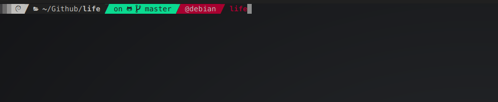
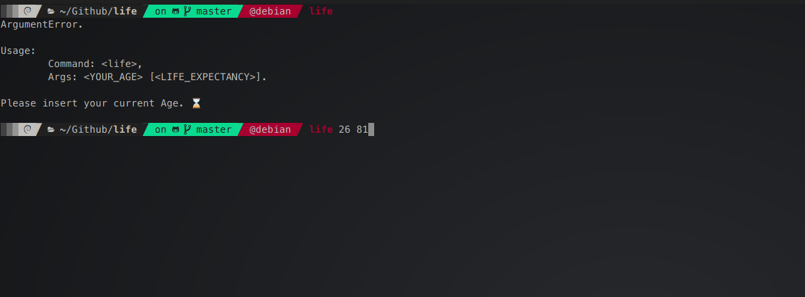
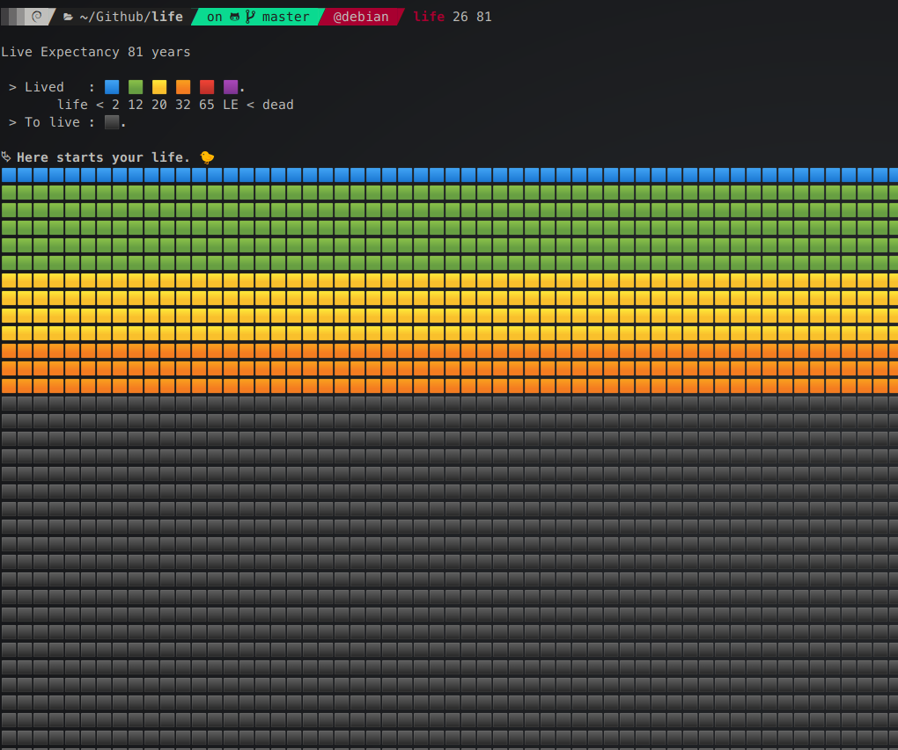

# life

It's a simple life calendar describer. So, just clone and cp this repository on your `$HOME/.local/bin/` directory.
✔️
### The only thing to do:  
`life <YOUR_AGE> [<LIFE_EXPECTANCY>]`

_"Life is not a problem to be solved, but a reality to be experienced."_  
-_**Soren Kierkegaard**_  
  

---

---

